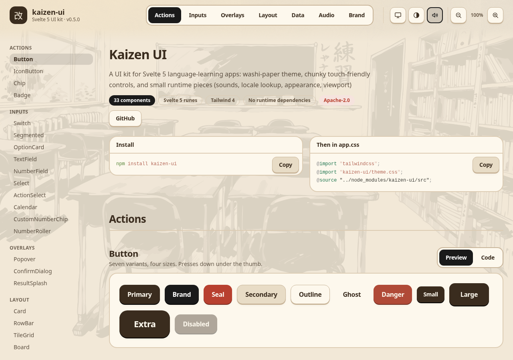
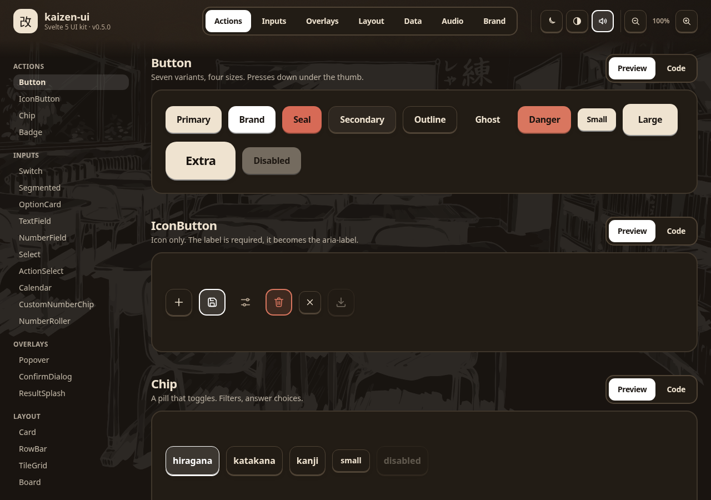
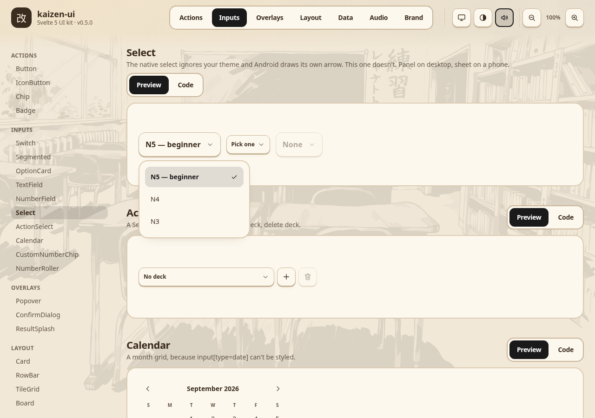
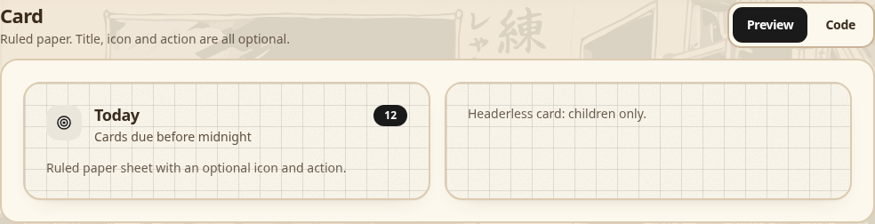
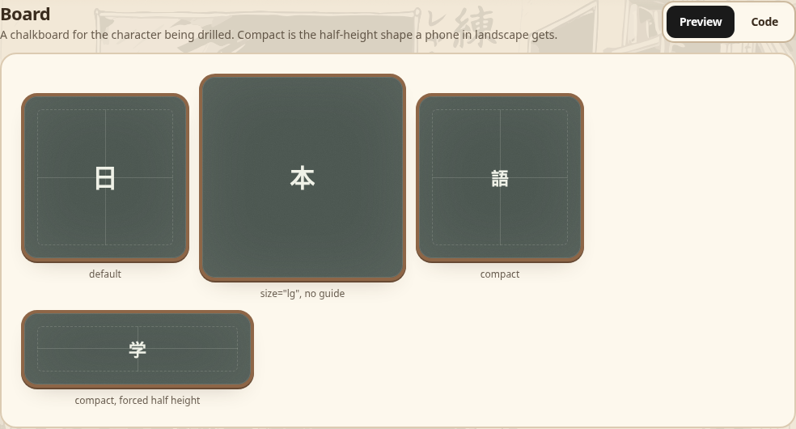
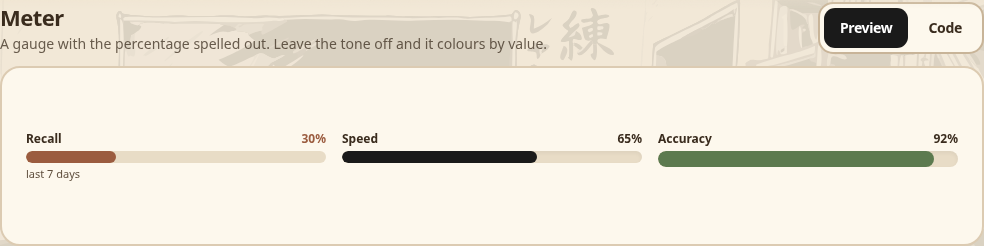
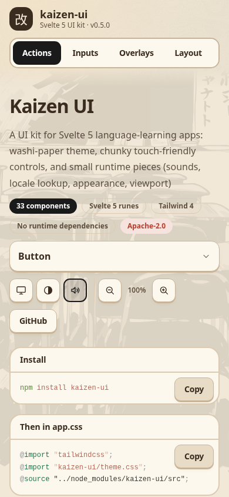
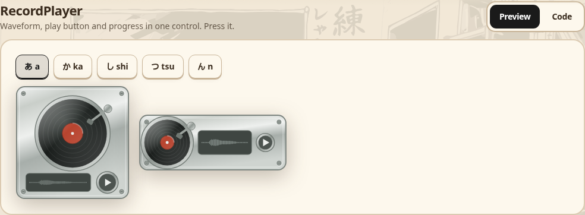

# kaizen-ui

A UI kit for Svelte 5 language-learning apps: washi-paper theme, chunky
touch-friendly controls, and small runtime pieces (sounds, locale lookup, appearance, viewport).

Continuously improve your learning experience with fast, accessible components
built for web and mobile.


**[Live docs and component gallery →](https://arsalan-anwari.github.io/kaizen-ui/)**

| Light | Dark |
| --- | --- |
|  |  |

| Select and Calendar | Cards |
| --- | --- |
|  |  |

| Chalkboards | Meters | Phone |
| --- | --- | --- |
|  |  |  |



## Install

```sh
npm install kaizen-ui
```

The package ships Svelte source, so the consuming app compiles it. 

If using Vite, exclude it from pre-bundling:

```js
optimizeDeps: { exclude: ["kaizen-ui"] }
```

## Theme

```css
@import "tailwindcss";
@import "kaizen-ui/theme.css";
@source "../node_modules/kaizen-ui/src";
```

The accent (`--brand`, `--ring`) is neutral ink: near-black on paper, white in the
dark theme. Override the variables after the import to give an app its own accent;
the high-contrast theme keeps its own yellow either way.

```css
:root:not(.dark):not(.high-contrast) {
  --brand: #1a6a4a;
  --brand-foreground: #ffffff;
  --brand-shadow: #0d4630;
  --brand-soft: color-mix(in srgb, #1a6a4a 8%, var(--surface));
  --ring: #1a6a4a;
}
```

## Components

`ActionSelect` `AppControls` `AppHeader` `AppMark` `Badge` `Board` `Button` `Calendar`
`Card` `Chip` `ConfirmDialog` `CustomNumberChip` `EmptyState` `Icon`
`IconButton` `Meter` `NumberField` `NumberRoller` `OptionCard` `PageBackdrop`
`PlayIcon` `Popover` `Progress` `RecordPlayer` `RowBar` `Segmented` `Select`
`Stat` `Switch` `TextField` `TileGrid` `Waveform`

## Runtime

```ts
import { bundlesFromGlob, registerLocales, setLocale } from "kaizen-ui";

registerLocales({
  bundles: bundlesFromGlob(
    import.meta.glob("./locales/*/*.json", { eager: true, import: "default" })
  ),
  locales: [{ tag: "en", name: "English" }],
  fallback: "en"
});
setLocale("auto");
```

## Licence

Apache-2.0
